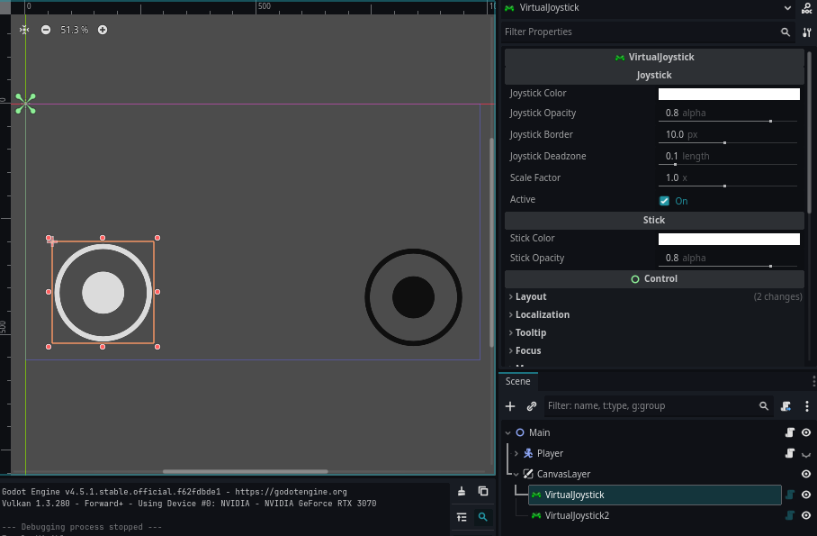

# Virtual Joystick for Godot

**VirtualJoystick** is a lightweight and fully customizable on-screen joystick plugin for **Godot Engine 4.4+**.  
Designed for mobile and touchscreen games, it provides smooth analog input handling, complete deadzone control, and responsive signals for precise player movement.

---

## Features

- Clean and modern UI with customizable colors, opacity, and scaling.
- Linear **deadzone** adjustment for natural analog feel.
- Provides normalized direction vector, distance, and multiple angle formats.
- Emits `analogic_changed`, `deadzone_enter`, and `deadzone_leave` signals.
- Plug-and-play integration with minimal setup required.
- Works seamlessly with both `Control`-based and 3D input systems.

---

## Installation

1. Copy the plugin folder to your Godot project's `addons/` directory:

   ```bash
   addons/virtual_joystick/
   ```

2. Enable it in the **Godot Editor**:  
   **Project → Project Settings → Plugins → VirtualJoystick → Enable**

---

## How to Use

1. Add a **VirtualJoystick** node to your scene.
2. Connect the `analogic_changed` signal to your player or camera controller.
3. Handle joystick input in GDScript:

   ```gdscript
   func _on_virtual_joystick_analogic_changed(value, distance, angle, angle_clockwise, angle_not_clockwise):
       velocity = value * max_speed
       move_and_slide(velocity)
   ```

---

## ⚙️ Exported Properties

| Property            | Type    | Description                                                             |
| ------------------- | ------- | ----------------------------------------------------------------------- |
| `joystick_color`    | `Color` | Base color of the joystick background.                                  |
| `joystick_opacity`  | `float` | Opacity of the joystick base (0–1).                                     |
| `joystick_border`   | `float` | Width of the joystick border.                                           |
| `joystick_deadzone` | `float` | Linear deadzone threshold (0–0.9).                                      |
| `scale_factor`      | `float` | Global scale multiplier for joystick size.                              |
| `active`            | `bool`  | Enables or disables joystick input.                                     |
| `only_mobile`       | `bool`  | Enables or disables the joystick display on mobile device screens only. |
| `stick_color`       | `Color` | Color of the movable stick (thumb).                                     |
| `stick_opacity`     | `float` | Opacity of the stick (0–1).                                             |

---

## Signals

| Signal                                                                           | Description                                            |
| -------------------------------------------------------------------------------- | ------------------------------------------------------ |
| `analogic_changed(value, distance, angle, angle_clockwise, angle_not_clockwise)` | Emitted whenever the stick moves outside the deadzone. |
| `deadzone_enter()`                                                               | Emitted when the stick enters the deadzone.            |
| `deadzone_leave()`                                                               | Emitted when the stick leaves the deadzone.            |

---

## Methods

| Method                                     | Returns   | Description                                 |
| ------------------------------------------ | --------- | ------------------------------------------- |
| `get_value()`                              | `Vector2` | Returns normalized direction vector.        |
| `get_distance()`                           | `float`   | Returns distance (0–1).                     |
| `get_angle_degrees_clockwise()`            | `float`   | Returns clockwise angle in degrees.         |
| `get_angle_degrees_not_clockwise()`        | `float`   | Returns counter-clockwise angle in degrees. |
| `get_angle_degrees(continuous, clockwise)` | `float`   | Returns specific angle configuration.       |

---

## Example Integration

```gdscript
@onready var joystick: VirtualJoystick = $VirtualJoystick

func _process(delta):
    var input_vec = joystick.get_value()
    var movement = input_vec * speed * delta
    move_and_slide(movement)
```

---

## Screenshots

**Screenshot InputManager**


